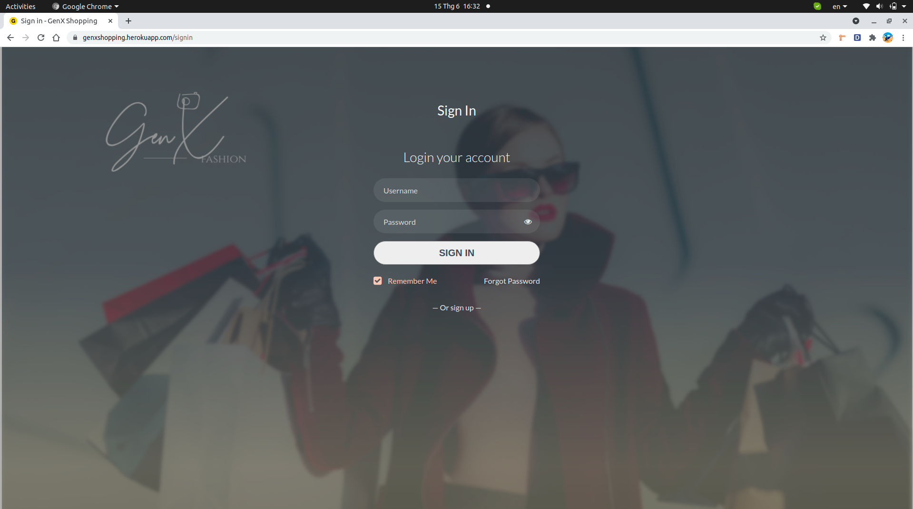

# GENXSHOPPING - API - WEBSITE 

## HOW TO RUN API
- Create environment python: python3 -m venv env
- Run environment: . env/bin/activate
- Run app: python3 app.py
### OR
- Run by docker: docker-compose up --build 

---
> **Visit us at: https://genxshopping.herokuapp.com/**

